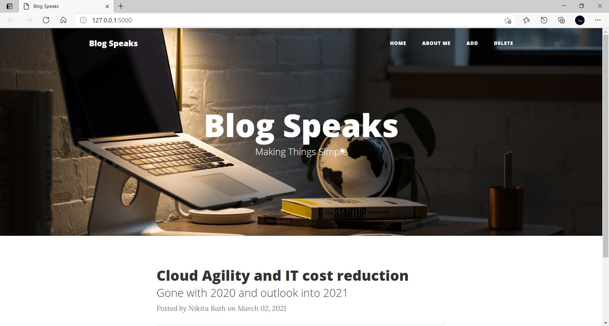

## Blogging Website using Flask

RESTful webservice created using Python Flask and SQLite for a Blogging website.

### Installation Requirements (libraries)

  1. ```pip install Flask```
  2. ```pip install Flask-SQLAlchemy```

### Web Application

<div align='center'>

</div>

### Steps of Code Execution

  1. Clone / Download this [repository](https://github.com/nikita9604/Automated-Voice-Controlled-Email-Sender)
  2. Unzip the downloaded folder
  3. Open any python editor (Here, [VS Code](https://code.visualstudio.com/) is used)
  4. Run this [python file](https://github.com/nikita9604/Blogging-Website-using-Flask/blob/main/app.py) and go to the link to execute the application.

### References

https://www.tutorialspoint.com/flask/index.htm
https://flask-restful.readthedocs.io/en/latest/
